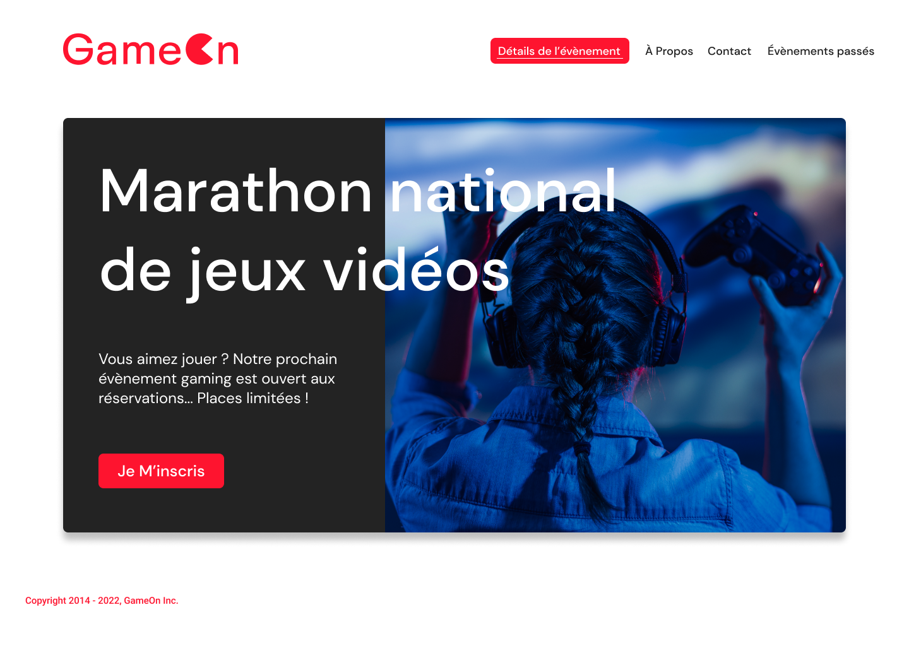

# GameOn

GameOn[^1] is a company specialized in conferences and game competitions. They reworked their website to simplify home page and inscription to contests.

**Goal of this project**: Add missing JavaScript to make the website and form functional (introduction to JavaScript).

## Load specifications

### Website designs

The desktop and mobile designs are available on Figma:
https://www.figma.com/file/B7NKBDvSI18uoMLJgpnh48/UI-Design-GameOn-FR



### Features

- Add feature to close the modal.
- Link labels to inputs in HTML.
- Verify that the form is valid when user clicks on "Submit".
- Verify that data are valid:
    * First name has 2 characters min / is not empty.
    * Last name has 2 characters min / is not empty.
    * E-mail address is valid.
    * For the number of competitions, a numeric value must be entered.
    * A radio button is selected.
    * General conditions are checked, the other is not mandatory.
- Form data is retained if form is not valid.
- Add custom error messages for each field.
- Add a confirmation message after submitting valid form.


## Launch

### GitHub Pages

The page is available at <https://aurelianeg.github.io/gameon/> on GitHub Pages.

### Cloning

1. Clone the repository

```sh
git clone https://github.com/aurelianeg/gameon.git
```

2. Launch the project with Live Server

```sh
live-server
```

It opens the website to view it in the browser. The page will reload when changes are made in the code.


[^1]: This is the 3rd project of the "Front-end developer (JS - React)" training by OpenClassrooms.